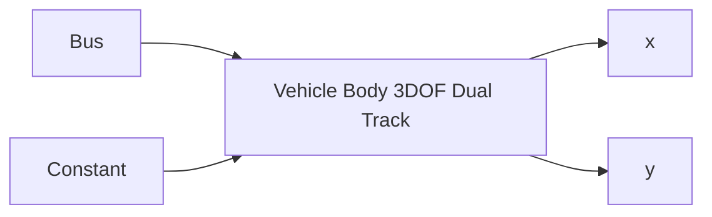

# 小迈步视频学习

>zhangqq  
>Nanjing  
>April 11, 2022
---

## 2022 小迈步车辆建模与仿真系列讲座
### Part 2: 搭建整车动力学模型用于底盘控制开发及整车性能评估
>楚骏楠&emsp;MathWorks中国

```mermaid
graph LR
Bus --> B[Vehicle Body 3DOF Dual Track]
Constant --> B[Vehicle Body 3DOF Dual Track]
B[Vehicle Body 3DOF Dual Track] --> x
B[Vehicle Body 3DOF Dual Track] --> y
```

